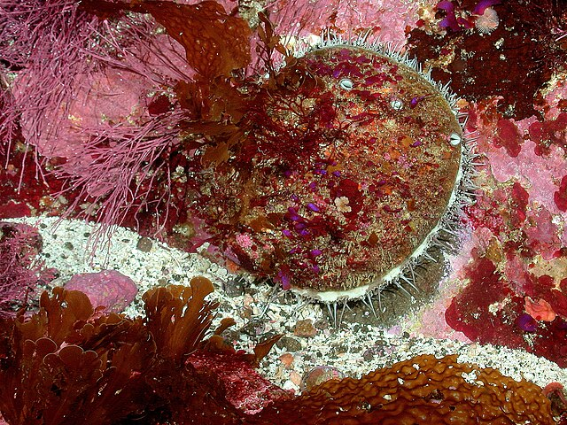

# Exploring the successes and setbacks of the White Abalone Captive Breeding Program
### eds240-infographic

This repository contains all code and output for the final project assignment for EDS240 - Data Visualization for the UCSB MEDS program. This project focuses on developing a data communication piece in the form of an infographic for data/question of choice.

In this project, I examine the successes and setbacks for the White Abalone Captive Breeding Program. This program was created in the interest of conserving the endangered White Abalone through captive breeding efforts. Over the last decade, this program has created millions of abalone but are still magnitudes under what is necessary to save this species. This project will focus specifically on reproductive patterns in the various stages of the life cycle present during captive breeding efforts.



## Data sources
These data are not publicly available, but contain information regarding white abalone counts, vitals (e.g. length, weight, sex), spawning, and pedigree.

## Repository structure

```bash
├── drafting-viz_files: Rendered final infographic files.
├── exploration_files: Rendered data exploration files.
├── .gitignore
│   └──  data: Data are not pushed to github, but recommended with this structure.
├── images: png and pdf files for all plots.
├── README.md: File for the readme.
├── drafting-viz.html: Rendered html project for final infographic.
├── drafting-viz.qmd: Code for this project for final infographic.
├── eds240-infographic.Rproj: R project file.
├── exploration.html: Rendered html project for data exploration.
├── exploration.pdf: Rendered pdf project for data exploration.
├── exploration.qmd: Code for this project for data exploration.
├── spaghetti.qmd: Code for practicing code, can be ignored.


```
## Author
This work was done by Leela Dixit, with assistance from students in EDS240, Sam Shanny-Csik and Annie Adams.

## Acknowledgments
Data come from the [White Abalone Captive Breeding Program](https://whiteabalone.org/) at University of California, Davis, Bodega Marine Laboratory.
