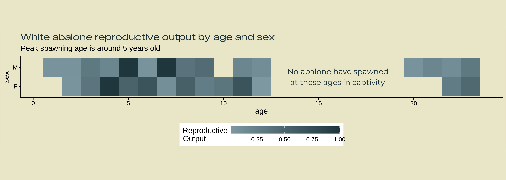
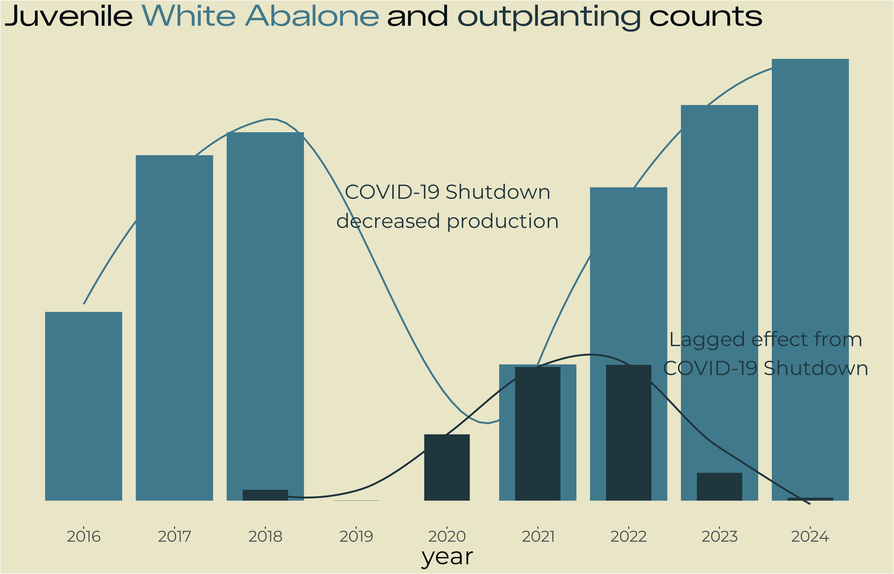
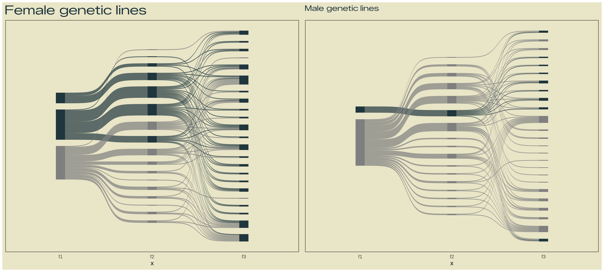
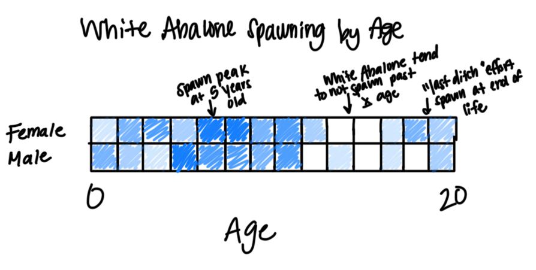
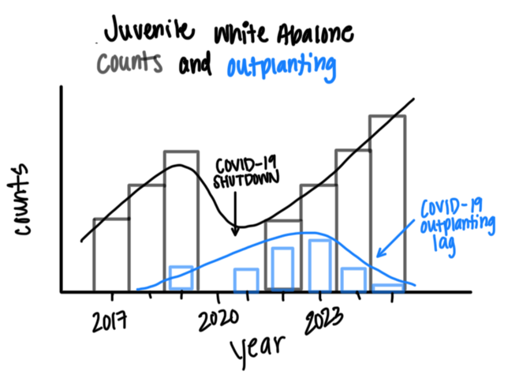
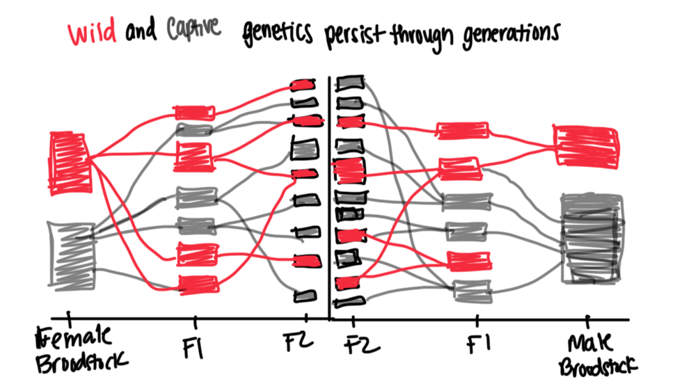

This file contains the first drafts of three data visualizations for the final project infographic for EDS 240 - Data Visualization and Communication.

The general theme of this infographic is examining the successes and complications for the White Abalone Captive Breeding Program. This program was created in the interest of conserving the endagered White Abalone through captive breeding efforts. Over the last decade, this program has created millions of abalone but are still magnitudes under what is necessary to save this species. This project will focus specifically on reproductive patterns in the various stages of the life cycle present during captive breeding efforts.

## Research Questions

The overall question for this infographic is:

What conservation strides (and setbacks) has the White Abalone Captive Breeding Program had since its inception?

Given that this program is based in advancing captive reproduction, we will focus on reproductive patterns in 3 life stages of white abalone:

-   Adults: How do males and females differ in their reproductive output based on their age?
-   Juveniles: Has the program increased the number of non-broodstock aged white abalone over time? How many of those have been sent for outplanting?
-   Larvae/Pelagic Stages: Have different genetic lines of abalone spawned more, and have those offspring spawned?

## Variables

Each visualization requires different variables, and different summarizing of those variables. We can break each down to see what we need to visualize:

-   Adults: Sex (categorical), reproductive output (female - numeric, males - integer), age (integer)
-   Juveniles: Non-broodstock abalone counts (integer), time (numeric, but treated as a factor), outplanting counts (integer)
-   Larvae/Pelagic Stages: Genetic lines (categorical), reproductive output (female - numeric, males - integer)

## Example Visualizations

We can search for similar visualizations to base our final visualizations off of based on our artistic vision and our variable types.

1.  Adults



2.  Juveniles



3.  Larvae



We can also draw out our final visualizations by hand so we have a scaffold to work off of when creating the visualization in R.

1.  Adult



2.  Juveniles



3.  Larvae



## First Draft Visualizations
Load libraries

```{r}
library(tidyverse)
library(here)
library(janitor)
library(showtext)
library(ggsankey)
library(patchwork)
```

Read in data

```{r}
# counts
counts <- read_csv(here("data", "Count_All_DataRaw.csv")) %>% 
  clean_names() %>% 
  remove_empty(c("rows", "cols"))
# spawning
spawn <- read_csv(here("data", "Spawning_All_DataRaw.csv")) %>% 
  clean_names() %>% 
  remove_empty(c("rows", "cols"))
#pedigree
pedigree <- read_csv(here("data", "White_Abalone_Pedigree_Data_Metadata(Pedigree).csv")) %>% 
  clean_names() %>% 
  remove_empty(c("rows", "cols"))
# transfer
transfer <- read_csv(here("data", "Transfer_All_DataRaw.csv")) %>% 
  clean_names() %>% 
  remove_empty(c("rows", "cols"))
```

Wrangle data

```{r}
#| output: false

# reconcile multiple pop_ids/messy naming conventions 
# when dates do not match, choosing the younger one

unique(counts$pop_id)
counts <- counts %>% 
  mutate(pop_id = case_when(
    pop_id == "16-03-02-Acjachemen,\n16-03-12-Tongva,\n16-03-02-Miwok,\n16-03-02-Pomo" ~ "16-03-02-NativeTribes",
    pop_id == "17-03-01-Merida, 17-03-01-Tiana" ~ "17-03-01-Tiana/Merida",
    pop_id == "17-03-01-Tiana, 17-03-01-Merida" ~ "17-03-01-Tiana/Merida",
    pop_id == "16-03-02-Acjachemen, 16-03-02-Tongua, 16-03-02-Miwok, 16-03-02-Pomo" ~ "16-03-02-NativeTribes",
    pop_id == "22-05-10-Bubbles, 22-05-10-Blossom" ~ "22-05-10-Bubbles/Blossom",
    pop_id == "19-04-16-Spongebob, 19-04-16-Patrick" ~ "19-04-16-Spongebob/Patrick",
    pop_id == "19-04-16-Squidward, 18-04-19-Ursula" ~ "19-04-16-Squidward/Ursula",
    pop_id == "21-04-21-Moderna,\n21-04-21-Pfizer,\n21-04-29-JandJ" ~ "21-04-21-Vaccines",
    pop_id == "17-03-01-Tiana,\n17-03-01-Merida" ~ "17-03-01-Tiana/Merida",
    pop_id == "16-03-02-Acjachemen, 16-03-02-Chumash, 16-03-02-Tongva, 16-03-02-Miwok, 16-03-02-Pomo" ~ "16-03-02-NativeTribes",
    pop_id == "22-03-01-Mardi, 22-03-09-WALLE" ~ "22-03-01-Mardi/WALLE",
    pop_id == "22-03-01-Mardi, 22-03-09-Walle" ~ "22-03-01-Mardi/WALLE",
    pop_id == "17-03-01-Belle, 16-03-02-Acjachemen, 16-03-02-Tongva, 16-03-02-Miwok, 16-03-02-Pomo, 16-03-02-Chumash,19-04-16-Squidward, 18-04-19-Ursula, 19-04-16-Spongebob, 19-04-16-Patrick, 17-03-01-Tiana, 17-03-01-Merida, 20-03-10-Smaug" ~ "20-03-10-Mixed",
    pop_id == "16-03-02-Acjachemen, 16-03-02-Tongva, 16-03-02-Miwok, 16-03-02-Pomo, 16-03-02-Chumash" ~ "16-03-02-NativeTribes",
    pop_id == "17-03-01-Belle,16-03-02-Acjachemen, 16-03-02-Tongva, 16-03-02-Miwok, 16-03-02-Pomo, 16-03-02-Chumash" ~ "16-03-02-NativeTribes/Belle",
    pop_id == "25-01-07-Hammerhead, 25-01-07-Nurse, 25-01-07-Epaulette" ~ "25-01-07-Sharks",
    TRUE ~ pop_id
  ))

unique(spawn$pop_id)
spawn <- spawn %>% 
  mutate(pop_id = case_when(
    pop_id == "14-04-23-Beaker, 14-05-13-Fozzie" ~ "14-05-13-Fozzie/Beaker",
    pop_id == "17-03-01-Tiana, 17-03-01-Merida" ~ "17-03-01-Tiana/Merida",
    pop_id == "19-04-16-Squidward, 18-04-19-Ursula" ~ "19-04-16-Squidward/Ursula",
    pop_id == "16-03-02-Acjachemen, 16-03-02-Tongva, 16-03-02-Miwok, 16-03-02-Pomo, 16-03-02-Chumash" ~ "16-03-02-NativeTribes",
    pop_id == "19-04-16-Spongebob, 19-04-16-Patrick" ~ "19-04-16-Spongebob/Patrick",                                                    
    pop_id == "14-04-30-Beaker,14-05-13-Fozzie" ~ "14-05-13-Fozzie/Beaker",
    pop_id == "16-03-02-Acjachemen, 16-03-02-Tongva, 16-03-02-Miwok, 16-03-02-Pomo, 16-03-02-Chumash, 16-03-02-Kumeyaay, 16-03-02-Salinan" ~ "16-03-02-NativeTribes",
    pop_id == "16-03-02-Acjachemen, 16-03-12-Tongva, 16-03-02-Miwok, 16-03-02-Pomo, 16-03-02-Chumash" ~ "16-03-02-NativeTribes",
    pop_id == "17-03-01-Belle, 16-03-02-Acjachemen, 16-03-02-Tongva, 16-03-02-Miwok, 16-03-02-Pomo, 16-03-02-Chumash" ~ "16-03-02-NativeTribes/Belle", 
    pop_id == "19-04-16-Squidward/18-04-19-Ursula" ~ "19-04-16-Squidward/Ursula",
    pop_id == "17-03-01-Tiana/17-03-01-Merida" ~ "17-03-01-Tiana/Merida",
    pop_id == "16-03-02-Acjachemen/16-03-02-Tongva/16-03-02-Miwok/16-03-02-Pomo/16-03-02-Chumash" ~ "16-03-02-NativeTribes",
    pop_id == "19-04-16-Spongebob/19-04-16-Patrick" ~ "19-04-16-Spongebob/Patrick",
    pop_id == "07-05-19-Jeffrey" ~ "17-05-19-Jeffrey",
    TRUE ~ pop_id
  ))

# clean transfer data
transfer_clean <- transfer %>% 
  filter(life_stage == "settled") %>% 
  # transform any variable with outplant or growout into only 'outplant'
  mutate(transport_purpose = case_when(
    transport_purpose == "Outplant" ~ "outplant",
    transport_purpose == "Outplant, Growout" ~ "outplant",
    transport_purpose == "growout, outplant" ~ "outplant",
    transport_purpose == "Growout" ~ "outplant",
    transport_purpose == "grow-out" ~ "outplant",
    transport_purpose == "growout" ~ "outplant",
    TRUE ~ transport_purpose))

# clean spawning data
spawn_clean <- spawn %>% 
  # remove unknown popID since no date
  filter(pop_id != "NA",
         pop_id != "UNKNOWN") %>% 
  mutate(born = str_sub(pop_id, start = 1, end = 8), # pull out years from pop ID
         born = as.Date(born, format = "%y-%m-%d"),
         # fix date for swedish fish pop since only year
         born = case_when(pop_id == "03-F1-SwedishChef" ~ as.Date("2003-01-01"),
                          TRUE ~ born),
         # calculate age at spawn date
         age = floor(time_length(interval(born, date), "years")),
         egg_count = as.numeric(egg_count)) %>% 
  # add 5 years to wilds, since we do not know their age
  mutate(age = case_when(pop_id == "04-12-05-Redwood" ~ age + 5,
                         pop_id == "17-01-31-Loblolly" ~ age + 5,
                         pop_id == "17-06-09-Sugar" ~ age + 5,
                         pop_id == "17-05-19-Jeffrey" ~ age + 5,
                         pop_id == "17-03-15-Ponderosa" ~ age + 5,
                         pop_id == "17-04-12-Torrey" ~ age + 5,
                         pop_id == "19-03-18-Ash" ~ age + 5,
                         pop_id == "17-11-13-Sequoia" ~ age + 5,
                         TRUE ~ age))

# clean counts
counts_clean <- counts %>% 
  filter(rack_type != "BST") %>% 
  mutate(year = year(date)) %>% 
#counts_clean <- counts_clean %>% 
  filter(facility == "BML") %>% 
  group_by(date) %>% 
  summarise(count = sum(count, na.rm = TRUE)) %>% 
  ungroup() %>% 
  mutate(type = "counts")
```

Initialize color theme
```{r}
pal <- c("background" = "#E9E5C7",
         "dark" = "#1F363D",
         "light" = "#40798C",
         "pink" = "#B05880",
         "green" = "#646F4B",
         "steel" = "#7D98A1",
         "lightsteel" = "#CFDEE7",
         "rose" = "#C3979F")
```

Initialize fonts
```{r}
font_add_google(name = "Zalando Sans Expanded", family = "zalando")
font_add_google(name = "Montserrat", family = "montserrat")
```

## Adults
We will represent peak spawning age with a heatmap plot.

1. Wrangle data for a heatmap plot.
```{r}
spawn_clean <- spawn_clean %>% 
  mutate(sex = ifelse(!is.na(egg_count), "F", NA)) %>% 
  mutate(sex = ifelse(!is.na(time_initial_spawn) & is.na(egg_count), "M", sex))

spawn_female <- spawn_clean %>% 
  filter(!is.na(sex),
         sex == "F") %>%
  group_by(age, sex) %>% 
  summarise(egg_count = sum(egg_count)) %>% 
  ungroup() %>% 
  mutate(ratio = egg_count / max(egg_count))

spawn_male <- spawn_clean %>% 
  filter(!is.na(sex),
         sex == "M") %>%
  group_by(age, sex) %>% 
  summarise(n = n()) %>% 
  ungroup() %>% 
  mutate(ratio = n / max(n)) 

spawn_plot <- full_join(spawn_female, spawn_male)
```

2. plot!
```{r}
showtext_auto(enable = TRUE)

annotation_heatmap1 <- glue::glue(
  "No abalone have spawned 
  at these ages in captivity")

heatmap <- ggplot(spawn_plot, aes(x = age, y = sex, fill = ratio)) +
  geom_tile() + 
  coord_fixed() +
  annotate(geom = "text",
           x = 16, y = 1.5,
           label = annotation_heatmap1,
           color = pal['dark'],
           hjust = "center",
           family = "montserrat") +
  scale_fill_gradient(low = pal['steel'], high = pal["dark"]) +
  theme_classic(base_size = 15) +
  labs(title = "White abalone reproductive output by age and sex",
       subtitle = "Peak spawning age is around 5 years old") +
  theme(legend.direction = "horizontal",
        legend.position = "bottom",
        panel.background = element_rect(fill = pal['background']),
        plot.background = element_rect(fill = pal['background']),
        plot.title = ggtext::element_markdown(family = "zalando",
                                              color = pal['dark']),
        legend.box.background = element_blank()) +
  guides(fill = guide_colorbar(title = "Reproductive\nOutput", 
                               barwidth = 15, barheight = 1))

showtext_auto(enable = FALSE)
```

## Juveniles
We will represent total captive and outplanted abalone counts with a simple histogram.

1. Wrangle data for histogram.
```{r}
transfer_outplant <- transfer_clean %>% 
  filter(#transport_purpose == "outplant",
         origin_facility == "BML") %>% 
  group_by(date) %>% 
  summarise(count = sum(as.numeric(numberofanimals), na.rm = TRUE)) %>%
  ungroup() %>% 
  mutate(type = "transfer")

counts_outplant <- full_join(transfer_outplant, counts_clean) %>% 
  mutate(year = year(date)) %>% 
  group_by(year, type) %>% 
  summarise(count = round(sum(count))) %>% 
  ungroup() %>%
  filter(year != 2025)
```

2. Plot!
```{r}
years <- c("2016", "2017", "2018", "2019", "2020", "2021", "2022", "2023", "2024")
breaks <- c(2016, 2017, 2018, 2019, 2020, 2021, 2022, 2023, 2024)

title <- glue::glue(
  "Juvenile
  <span style='color:#40798C;'>White Abalone</span>
  and
  <span style='color:#1F363D;'>outplanting</span>
  counts"
)

annotation_histo1 <- glue::glue(
  "COVID-19 Shutdown
  decreased production")

annotation_histo2 <- glue::glue(
  "Lagged effect from
  COVID-19 Shutdown")

showtext_auto(enable = TRUE)

histogram <- ggplot(counts_outplant %>% filter(type == "counts"), 
       aes(x = year, y = count)) +
  geom_col(width = .85, fill = pal["light"]) +
  geom_smooth(data = counts_outplant %>% filter(type == "counts"),
              se = FALSE, color = pal["light"]) +
  geom_col(data = counts_outplant %>% filter(type == "transfer"),
           aes(x = year, y = count),
           fill = pal['dark'], width = .5) +
  geom_smooth(data = counts_outplant %>% filter(type == "transfer"),
              se = FALSE, color = pal['dark']) +
  annotate(geom = "text",
           x = 2020, y = 20000,
           label = annotation_histo1,
           color = pal['dark'],
           hjust = "center",
           family = "montserrat",
           size = 8) +
  annotate(geom = "text",
           x = 2023.5, y = 10000,
           label = annotation_histo2,
           color = pal['dark'],
           hjust = "center",
           family = "montserrat",
           size = 8) +
  labs(title = title,
       ) +
  theme(base_size = 10,
        panel.background = element_rect(fill = pal['background']),
        plot.background = element_rect(fill = pal['background']),
        panel.grid.major = element_blank(),
        panel.grid.minor = element_blank(),
        plot.title = ggtext::element_markdown(family = "zalando",
                                              color = "#040D10",
                                              size = rel(3)),
        axis.title.y = element_blank(),
        axis.ticks.y = element_blank(),
        axis.text.y = element_blank(),
        axis.text.x = element_text(size = rel(2), 
                                   family = "montserrat"),
        axis.title.x = element_text(size = rel(2.5),
                                    family = "montserrat")) +
  scale_x_continuous(breaks = breaks,
                     labels = years)

showtext_auto(enable = FALSE)
```

Larval genetics
We will visualize the presence of male and female wild white abalone genetics in captive white abalone populations with a side-by-side sankey diagram. 

1. Wrangle data for female sankey diagram.
```{r}
pedigree_f <- pedigree %>% 
  filter(!is.na(mother_pop_id)) %>% 
  #filter(if_any(c(mother_pop_id), ~str_detect(., test))) %>% 
  select(pop_id, mother_pop_id) %>%
  separate_longer_delim(mother_pop_id, delim = ", ") %>% 
  separate_longer_delim(mother_pop_id, delim = "/") %>% 
  separate_longer_delim(mother_pop_id, delim = ";") %>% 
  separate_longer_delim(mother_pop_id, delim = " OR ") %>% 
  mutate(mother_pop_id = case_when(
    mother_pop_id == "01-04-23-Scooter (GRN_310)" ~ "01-04-23-Scooter",
    mother_pop_id == "13-04-04-Rowlf (ORN_032)" ~ "13-04-04-Rowlf",
    mother_pop_id == "Parental PopIDs possible: 16-03-02-Acjachemen" ~ "16-03-02-Acjachemen",
    mother_pop_id == "SEE NOTES. N=6 females:\nN=2 18-04-09-Ursula (NYL_667" ~ "18-04-09-Ursula",
    mother_pop_id == "\nN=1 19-04-16-Patrick (NYL_681)" ~ "19-04-16-Patrick",
    mother_pop_id == "\nN=1 16-03-02-Acjachemen" ~ "16-03-02-Acjachemen",
    mother_pop_id == "16-03-02-Chumash (LAV_063)" ~ "16-03-02-Chumash",
    mother_pop_id == "01-04-23-Scooter (GRN_364)" ~ "01-04-23-Scooter",
    mother_pop_id == "13-04-04-Rowlf (ORN_017)" ~ "13-04-04-Rowlf",
    mother_pop_id == "\nN=1 19-04-16-Spongebob (NGN_624)" ~ "19-04-16-Spongebob",
    mother_pop_id == "17-03-01-Tiana (LAV_006)" ~ "17-03-01-Tiana",
    mother_pop_id == "\nN=1 17-03-01-Merida" ~ "17-03-01-Merida",
    mother_pop_id == "20-03-10-Smaug\n" ~ "20-03-10-Smaug",
    TRUE ~ mother_pop_id
  )) %>% 
  filter(mother_pop_id != "NYL_677)",
         mother_pop_id != "Unknown PopID BST Tank 5")

pedigree_f_brood <- tibble(unique(pedigree_f$mother_pop_id)) %>% 
  rename(mother_pop_id = "unique(pedigree_f$mother_pop_id)") %>% 
  left_join(pedigree_f) %>% 
  rename(f1 = mother_pop_id,
         mother_pop_id = pop_id) 

pedigree_f_1 <- pedigree_f_brood %>% 
  filter(!f1 %in% mother_pop_id)

pedigree_f_2 <- pedigree_f_brood %>% 
  filter(f1 %in% mother_pop_id) %>% 
  rename(mother_pop_id = f1,
         f3 = mother_pop_id)

pedigree_f_long <- pedigree_f_1 %>% 
  left_join(pedigree_f_2) %>% 
  rename(f2 = mother_pop_id) %>% 
  filter(!is.na(f3)) %>% 
  make_long(f1, f2, f3)
```

2. Plot female genetic lines.
```{r}
showtext_auto(enable = TRUE)

ped_female <- ggplot(pedigree_f_long, aes(x = x, 
               next_x = next_x, 
               node = node, 
               next_node = next_node, 
               fill = factor(node), 
               label = node)) +
  geom_sankey(flow.alpha = 0.7,
              show.legend = FALSE) +
  scale_fill_manual(values = c('17-03-15-Ponderosa' = "#1F363D",
                               '17-01-31-Loblolly'  ="#1F363D",
                               '17-03-01-Tiana' = "#1F363D",
                               "19-04-16-Plankton" = "#1F363D",
                               "19-04-16-Spongebob" = "#1F363D",
                               "19-04-16-Patrick" = "#1F363D",
                               "21-04-21-BioNTech" = "#1F363D",
                               "19-04-16-Squidward" = "#1F363D",
                               "20-03-10-Smaug" = "#1F363D",
                               "22-02-10-Ciri" = "#1F363D",
                               "22-05-10-Buttercup" = "#1F363D",
                               "24-02-13-Cormorant" = "#1F363D",
                               "23-02-08-Eevee" = "#1F363D",
                               "23-02-08-Polywag" = "#1F363D",
                               "23-04-05-Fiona" = "#1F363D",
                               "23-04-05-Farquaad" = "#1F363D",
                               "23-05-17-Funktopus" = "#1F363D",
                               "23-11-18-Artichoke" = "#1F363D",
                               "24-02-13-Goldfinch" = "#1F363D",
                               "24-02-13-Scrubjay" = "#1F363D",
                               "25-01-07-Nurse" = "#1F363D",
                               "25-03-11-Merry" = "#1F363D",
                               "25-03-11-Samwise" = "#1F363D",
                               "25-03-11-Rosie" = "#1F363D",
                               "25-05-15-Cauliflower" = "#1F363D",
                               "24-02-13-Peregrine" = "#1F363D",
                               "24-02-13-Seagull" = "#1F363D",
                               "25-01-07-Sevengill" = "#1F363D",
                               "25-01-07-Whale" = "#1F363D",
                               "25-03-11-Bilbo" = "#1F363D")) +
  labs(title = "Female genetic lines") +
  theme_minimal(base_size = 15) +
  theme(panel.background = element_rect(fill = pal['background']),
        plot.background = element_rect(fill = pal['background']),
        axis.text.y = element_blank(),
        panel.grid.major = element_blank(),
        panel.grid.minor = element_blank(),
        plot.title = ggtext::element_markdown(family = "zalando",
                                              color = pal['dark']))

showtext_auto(enable = FALSE)
```


3. Wrangle data for male sankey diagram.
```{r}
pedigree_m <- pedigree %>% 
  filter(!is.na(father_pop_id)) %>% 
  select(pop_id, father_pop_id) %>% 
  separate_longer_delim(father_pop_id, delim = ", ") %>% 
  separate_longer_delim(father_pop_id, delim = "/") %>% 
  separate_longer_delim(father_pop_id, delim = ";") %>% 
  separate_longer_delim(father_pop_id, delim = " OR ") %>% 
  separate_longer_delim(father_pop_id, delim = ",") %>% 
  separate_longer_delim(father_pop_id, delim = "\n") %>%
  mutate(father_pop_id = case_when(
    father_pop_id == "Parental PopIDs possible: 16-03-02-Acjachemen" ~ "16-03-02-Acjachemen",
    father_pop_id == "13-04-04-Rowlf and" ~ "13-04-04-Rowlf",
    father_pop_id == "or 13-03-02-Janice" ~ "13-03-02-Janice",
    father_pop_id == "17-03-01-Merida (WHT_159)" ~ "17-03-01-Merida",
    father_pop_id == "17-03-01-Belle (WHT(TAN?)_222)" ~ "17-03-01-Belle",
    father_pop_id == "Jabalone Expt: 18-04-19-Ursula (NYL_672)" ~ "18-04-19-Ursula",
    father_pop_id == "18-04-19-Ursula (NYL_669)" ~ "18-04-19-Ursula",
    father_pop_id == "17-03-01-Belle (NGN_151)" ~ "17-03-01-Belle",
    father_pop_id == "01-04-23-Scooter (GRN_371" ~ "01-04-23-Scooter",
    father_pop_id == "13-03-02-Janice (ORN_001)" ~ "13-03-02-Janice",
    father_pop_id == "01-04-23-Scooter(GRN_305" ~ "01-04-23-Scooter",
    father_pop_id == "\n17-03-01-Belle (n=1) " ~ "17-03-01-Belle",
    father_pop_id == "16-03-02-Salinan (n=1)" ~ "16-03-02-Salinan",
    father_pop_id == "17-03-01-Belle (n=1) " ~ "17-03-01-Belle",
    TRUE ~ father_pop_id
  )) %>% 
  filter(father_pop_id != "",
         father_pop_id != "GRN_371)",
         father_pop_id != "GRN_305)")

pedigree_m_brood <- tibble(unique(pedigree_m$father_pop_id)) %>% 
  rename(father_pop_id = "unique(pedigree_m$father_pop_id)") %>% 
  left_join(pedigree_m) %>% 
  rename(f1 = father_pop_id,
         father_pop_id = pop_id) 

pedigree_m_1 <- pedigree_m_brood %>% 
  filter(!f1 %in% father_pop_id)

pedigree_m_2 <- pedigree_m_brood %>% 
  filter(f1 %in% father_pop_id) %>% 
  rename(father_pop_id = f1,
         f3 = father_pop_id)

pedigree_m_long <- pedigree_m_1 %>% 
  left_join(pedigree_m_2) %>% 
  rename(f2 = father_pop_id) %>% 
  filter(!is.na(f3)) %>% 
  make_long(f1, f2, f3)
```

4. Plot male genetic lines.
```{r}
showtext_auto(enable = TRUE)

ped_male <- ggplot(pedigree_m_long, aes(x = x, 
               next_x = next_x, 
               node = node, 
               next_node = next_node, 
               fill = factor(node), 
               label = node)) +
  geom_sankey(flow.alpha = 0.7,
              show.legend = FALSE) +
  scale_fill_manual(values = c('17-11-13-Sequoia' = "#1F363D",
                               "19-04-16-Patrick" = "#1F363D",
                               "23-11-18-Artichoke" = "#1F363D",
                               '24-02-13-Goldfinch' = "#1F363D",
                               "24-02-13-Osprey" = "#1F363D",
                               "24-02-13-Scrubjay" = "#1F363D",
                               "24-02-13-Seagull" = "#1F363D",
                               "24-04-23-Nemo" = "#1F363D",
                               "25-01-07-Epaulette" = "#1F363D",
                               "2025-01-07-Rocky" = "#1F363D",
                               "25-05-15-Cauliflower" = "#1F363D"
                               )) +
  labs(title = "Male genetic lines") +
  theme_minimal(base_size = 15) +
  theme(axis.text.y = element_blank(),
        panel.background = element_rect(fill = pal['background']),
        plot.background = element_rect(fill = pal['background']),
        panel.grid.major = element_blank(),
        panel.grid.minor = element_blank(),
        plot.title = ggtext::element_markdown(family = "zalando",
                                              color = pal['dark']))

showtext_auto(enable = FALSE)
```

5. Patch male and female sankey diagrams together.
```{r}
sankey <- (ped_female | ped_male)
```

Save all plots.
```{r}
showtext_auto(enable = TRUE)
showtext_opts(dpi = 300)

ggsave(
  file = here("images", "heatmap.pdf"),
  plot = heatmap,
  device = "pdf",
  width = 14, height = 5, unit = "in",
  dpi = 300
)
ggsave(
  file = here("images", "histogram.pdf"),
  plot = histogram,
  device = "pdf",
  width = 14, height = 9, unit = "in",
  dpi = 300
)
ggsave(
  file = here("images", "sankey.pdf"),
  plot = sankey,
  device = "pdf",
  width = 20, height = 9, unit = "in",
  dpi = 300
)

showtext_auto(enable = FALSE)
```

### Conclusions

1. What are the key insights you want your infographic to communicate, and how will your design choices help highlight and support those messages?

They key takeaways I want my infographic to communicate is that the White Abalone Captive Breeding program has, over the last decade of the program, had a lot of success in their captive breeding efforts but that there are still uncertainties and limitations to overcome. Ideally, each plot has a "success" and "limitation" that can be interpreted, which I can help facilitate with targeted annotations, limiting visual noise to uneccessary patterns, and intentional color choices that draw the eyes to what messages I am trying to show.

2. What challenges did you encounter or anticipate encountering as you continue to build / iterate on your visualizations in R? If you struggled with mocking up any of your three visualizations, describe those challenges here.

My biggest challenge was having a vision for my visualization, executing that vision, and realizing my data simply do not work because of either small sample size, insufficient data, or patterns not being represented well. This required a lot of going back to the drawing board until I found appropriate viz options. The Sankey diagram was particularly challenging, as the initial message I was hoping to send was extremely complicated to actually code. I ended up shifting the message slightly so it still fits my story, but is also feasible to code. Additionally, I'm having issues with font not showing up for some plots, and will need to troubleshoot that some more.

3. What ggplot extension tools / packages do you need to use to build your visualizations? Are there any that we haven’t covered in class that you’ll be learning how to use for your visualizations?

I will be using `showtext` for font additions, and `patchwork` to visualize the two sankey diagrams next to each other. `ggsankey` is the package that integrates sankey diagrams into ggplot. After trying a few different packages, this was the most seamless and easy to use with the time constraints of the program.

4. What feedback do you need from the instructional team and / or your peers to ensure that your intended message and key insights are clear?

My main issue right now is my color scheme and organization. I don't like my colors, as I am trying to integrate the White Abalone team's blue color and a white abalone's pink shell. I think perhaps I need to just diverge from those colors to something new, as I am struggling with the darker background. I included a bunch of variations of the colors I chose, but honestly I do not like any of them! So any feedback is appreciated. I also am curious if my juvenile histogram plot is both informative and visually interesting. I struggled to think of different ways to show the lagged trend, but histograms seemed to be the best.